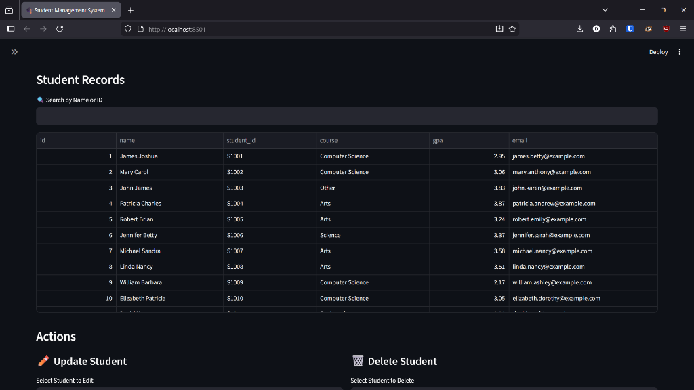
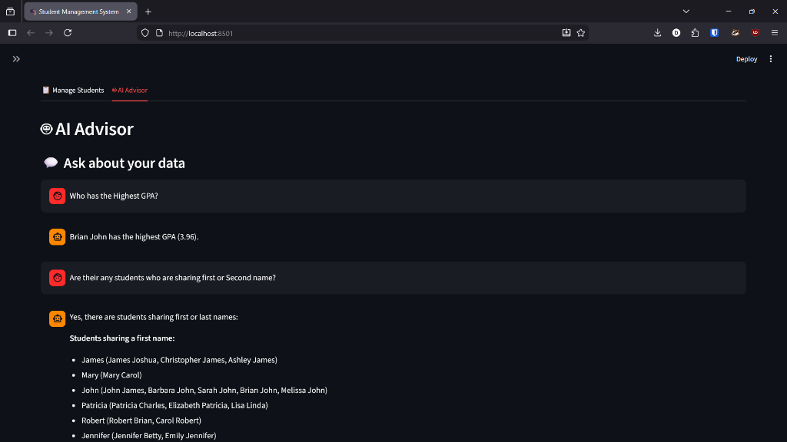
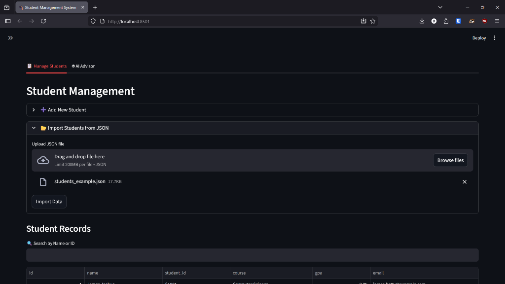
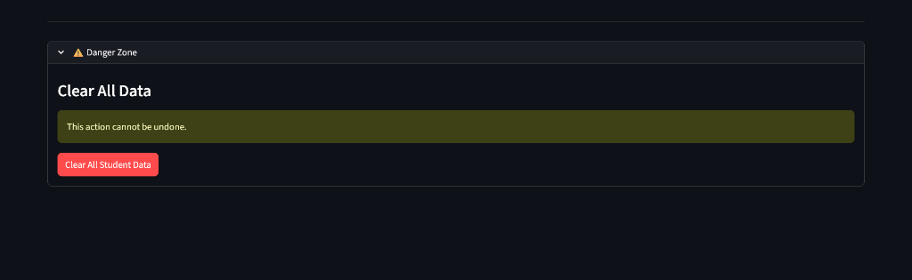

# 🎓 Smart Student Dashboard

> **A modern, AI-powered Student Management System built with Python and Streamlit.**


## 🚀 Project Overview

This project demonstrates the integration of **Generative AI** into a practical, data-driven application. Unlike traditional CRUD apps, the **Smart Student Dashboard** leverages Google's **Gemini 2.5 Flash** model to provide intelligent insights, enabling users to interact with their data using natural language.

**Key Technical Skills Showcased:**
*   **Full-Stack Python Development**: Built a robust UI and backend logic using Streamlit.
*   **AI & LLM Integration**: Implemented RAG-like (Retrieval-Augmented Generation) features to allow AI to "read" and analyze database records.
*   **Database Management**: Designed a persistent SQLite database schema for reliable data storage.
*   **Data Engineering**: Created JSON parsing pipelines for bulk data migration.

---

## 📸 Application Screenshots

### 1. Comprehensive Data Management
View, filter, and search through student records in real-time. The interface is designed for clarity and ease of use.


### 2. AI-Powered Advisor
The standout feature of this application. Ask questions like *"Who has the highest GPA?"* or *"Write a study plan for John"*, and the AI analyzes the live database to give you an answer.


### 3. Bulk Data Import
Migrate data effortlessly. The system accepts JSON files to bulk-import student records, handling duplicates and validation automatically.


### 4. Easy Updates & Deletion
Modify student details or remove records with a few clicks, ensuring your database is always up to date.


### 5. Data Export & Reset
Download your entire dataset as **CSV** or **JSON** for backup or external analysis. Includes a "Danger Zone" to securely wipe all data when needed.


---

## 🛠️ Installation & Setup

1.  **Clone the Repository**
    ```bash
    git clone <your-repo-url>
    cd "Student Management System"
    ```

2.  **Install Dependencies**
    ```bash
    pip install -r requirements.txt
    ```

3.  **Configure Environment**
    *   Create a `.env` file in the root directory.
    *   Add your Google Gemini API Key:
        ```env
        GEMINI_API_KEY=your_api_key_here
        ```

4.  **Run the Application**
    ```bash
    streamlit run app.py
    ```

---

## 📂 Testing with Example Data

To help you explore the features immediately, I have included a test dataset: `students_example.json`.

**How to use it:**
1.  Launch the app.
2.  Go to the **"Manage Students"** tab.
3.  Expand the **"Import Students from JSON"** section.
4.  Drag and drop the `students_example.json` file (located in the project root).
5.  Click **"Import Data"**.

This will instantly populate your database with **50 diverse student records**, allowing you to test the search, filtering, and AI analysis features without manual entry.

---

## 🤖 Tech Stack

*   **Frontend/Backend**: Streamlit
*   **Database**: SQLite3
*   **AI Model**: Google Gemini 2.5 Flash (`google-generativeai`)
*   **Data Handling**: Pandas
